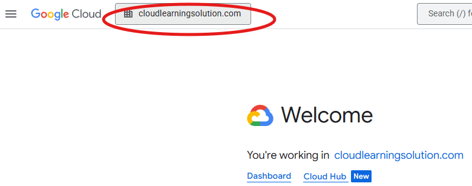
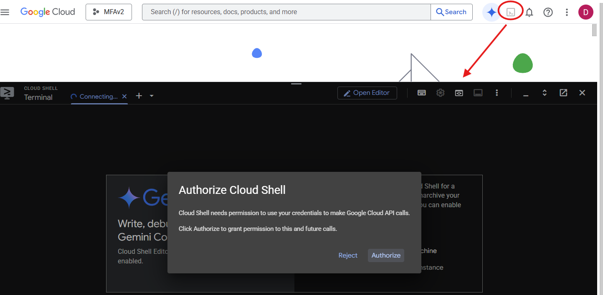

# MLOPS Model Migration Workshop – Week 2: Core Architecture - Hands-On Workshop

---

## Module Learning Objectives

By the end of this workshop, participants will be able to:

- Compare and contrast AWS and Google Cloud global infrastructure architectures
- Explore topologies across both platforms
- Map AWS services to Google Cloud service equivalents for AI/ML pipeline workloads

---

## Prerequisites

- Completion of Module 1: Cost Optimization
- AWS Management Console access with infrastructure permissions
- Google Cloud Console access with project access rights

---

## Workshop Overview

This hands-on workshop builds upon the cost management foundation from Module 1 to establish the technical architecture knowledge required for successful AWS to Google Cloud ML migrations. Using **console interfaces** and **CloudShell**, participants will gain practical experience with infrastructure services, networking, and IAM configurations across both platforms.

---

## Module 1: AWS Global Infrastructure and Core Resources

# 🧪 Lab 2.1: AWS Regions and Availability Zones Architecture Deep Dive

**Duration:** 45 minutes
**Objective:** Explore AWS global infrastructure and availability zone design using CLI and console-based inspection—without finalizing resource creation.

---

## 1. Prerequisites

- AWS Management Console access with EC2 and CloudShell permissions

- AWS CLI available via CloudShell or local environment

- Familiarity with basic AWS terminology (Region, AZ, CLI)

- No EC2 instance creation required

---

## 2. Theory Overview

- AWS infrastructure is organized into regions and availability zones

- Each region is a geographically isolated location with multiple AZs

- Availability Zones are independent failure domains within a region

- Opt-in regions must be manually enabled before use

- High availability strategies use multiple AZs to ensure fault tolerance

---

## 3. Hands-On Exploration Steps (Do Not Finalize Resources)

### 10. Access AWS Console

- Navigate to [AWS Console](https://console.aws.amazon.com)

- Launch CloudShell from the top navigation bar

### 11. Explore Available Regions

- Run: `aws ec2 describe-regions --output table`

- Run: `aws ec2 describe-regions --query 'Regions[*].[RegionName,OptInStatus]' --output table`

- Identify which regions require opt-in

### 12. Explore Availability Zones

- Run: `aws ec2 describe-availability-zones --output table`

- Run: `aws ec2 describe-availability-zones --region us-east-1 --output table`

- Observe zone names and states

### 13. Inspect Region Selector in EC2 Console

- Navigate to **EC2 > Instances > Launch Instance**

- Use the region dropdown to compare AZ counts

- Cancel before launching any instance

### 14. Sketch Region-to-Zone Mapping

- Identify 3 regions and list their AZs

- Note differences in zone naming and availability

---

## 4. Deliverables

- Table of AWS Regions and Opt-In status

- List of AZs for `us-east-1` and two other regions

- Notes on regional design considerations and zone distribution

---

## 5. Supplemental Materials

- Runbook: `runbooks/aws-region-az-exploration.md`

- Playbook: `playbooks/aws-ha-topology-strategy.md`

---

## 6. Notes and Warnings

- Do not launch EC2 instances or other resources during this lab

- AZ names (e.g., `us-east-1a`) are account-specific and may vary

- Opt-in regions may require manual activation before use

---

## 7. Verification Source

- Validated against [AWS EC2 Regions and AZs Documentation](https://docs.aws.amazon.com/AWSEC2/latest/UserGuide/using-regions-availability-zones.html)

---

# 🧪 Lab 2.2: AWS Edge Locations and CloudFront Global Network Exploration

**Duration:** 45 minutes
**Objective:** Explore AWS’s global content delivery infrastructure using CloudFront and edge location metadata—without deploying distributions or modifying resources.

---

## 1. Prerequisites

- AWS Management Console access with CloudFront and CloudShell permissions

- AWS CLI available via CloudShell or local environment

- Basic understanding of CDN concepts (edge location, origin, cache)

- No CloudFront distribution creation required

---

## 2. Theory Overview

- AWS CloudFront is a content delivery network (CDN) that uses a global network of edge locations

- Edge locations cache content closer to users to reduce latency

- Regional edge caches act as mid-tier caches between origin and edge locations

- CloudFront integrates with other AWS services like S3, EC2, and Lambda@Edge

- Edge locations are distributed across major cities and regions worldwide

---

## 3. Hands-On Exploration Steps (Do Not Finalize Resources)

### 10. Access AWS Console

- Navigate to [AWS Console](https://console.aws.amazon.com)

- Launch CloudShell from the top navigation bar

### 11. Explore Edge Location Metadata

- Run: `aws cloudfront list-distributions --output json`

- If no distributions exist, proceed to inspect global infrastructure

- Run: `aws cloudfront get-distribution-config --id <distribution-id>` (only if read-only distributions exist)

### 12. Review Global Edge Network

- Navigate to **CloudFront > Locations** in AWS Console

- Observe map of edge locations and regional edge caches

- Note geographic distribution and latency zones

### 13. Inspect CloudFront Console

- Navigate to **CloudFront > Distributions**

- Select any existing distribution (if available)

- Review origin settings, cache behaviors, and edge associations

- Do not create or modify any distributions

### 14. Compare Edge Location Coverage

- Identify 3 cities with edge locations from the AWS map

- Note proximity to major user populations

- Record latency benefits and strategic placement rationale

---

## 4. Deliverables

- List of global edge locations and regional edge caches

- Summary of CloudFront distribution architecture (if read-only access available)

- Notes on geographic distribution and latency optimization strategy

---

## 5. Supplemental Materials

- Runbook: `runbooks/aws-cloudfront-edge-location-inspection.md`

- Playbook: `playbooks/aws-global-cdn-strategy.md`

---

## 6. Notes and Warnings

- Do not create or modify CloudFront distributions during this lab

- Edge location availability may vary by region and account

- CLI output may be empty if no distributions exist—this is expected

---

## 7. Verification Source

- Validated against [AWS CloudFront Documentation](https://docs.aws.amazon.com/AmazonCloudFront/latest/DeveloperGuide/Introduction.html)

---

# 🧪 Lab 2.3: Google Cloud Regions and Zones Architecture Analysis

**Duration:** 45 minutes
**Objective:** Explore Google Cloud’s global infrastructure, focusing on regions, zones, and service availability—without deploying any resources.

---

## 1. Prerequisites

- Google Cloud Console access with project-level permissions

- Cloud Shell enabled

- Basic understanding of cloud infrastructure concepts

- Ensure the Compute Engine API is enabled for your project

- No VM instance creation required

---

## 2. Theory Overview

- Google Cloud has over 40 regions and 100+ zones globally

- Each region is a geographic location containing multiple isolated zones

- Zones are independent failure domains connected via Google’s private high-speed network

- Most regions contain three or more zones housed in separate physical facilities

- Service availability may vary by region and zone

---

## 3. Hands-On Exploration Steps (Do Not Finalize Resources)

### 11. Access Google Cloud Console

- Navigate to [Google Cloud Console](https://console.cloud.google.com)

- Use the Project Picker to select your project

### 12. Activate Cloud Shell

- Click the terminal icon in the top navigation bar

### 13. Explore Regions and Zones via CLI

- Run: `gcloud compute regions list --format="table(name,status,zones.len():label=ZONES)"`

- Run: `gcloud compute regions describe us-central1`

- Run: `gcloud compute zones list --format="table(name,region,status)"`

- Run: `gcloud compute zones list --filter="region:us-central1" --format="table(name,status)"`

### 14. Inspect Region-Zone Mapping via Console

- Navigate to **Compute Engine > VM instances > Create Instance**

- Use the Region dropdown to view available zones

- Cancel before deploying any instance

### 15. Check Service Availability

- Run: `gcloud ai models list --region=us-central1 2>/dev/null || echo "Vertex AI not available in this region"`

- Run: `gcloud compute machine-types list --zones=us-central1-a --filter="name:n1-standard"`

---

## 4. Deliverables

- Region and zone availability matrix

- Notes on service availability for Vertex AI and machine types

- Observations on zone distribution and naming conventions

---

## 5. Supplemental Materials

- Runbook: `runbooks/gcp-region-zone-exploration.md`

- Playbook: `playbooks/gcp-multi-zone-deployment-strategy.md`

---

## 6. Notes and Warnings

- Do not finalize VM creation during this lab

- Zone names (e.g., `us-central1-a`) may vary by region and project

- Some services are region-specific—verify availability before planning deployments

---

## 7. Verification Source

- Validated against [Google Cloud Regions and Zones Documentation](https://cloud.google.com/compute/docs/regions-zones)
---

# 🧪 Lab 2.4: Google Cloud Edge Network and Cloud CDN Exploration

**Duration:** 45 minutes  
**Objective:** Explore Google Cloud’s edge infrastructure and understand how Cloud CDN accelerates content delivery using globally distributed edge locations—without finalizing resource creation.

---

## 1. Prerequisites

- Google Cloud Console access with project-level permissions  

- Cloud Shell enabled  

- Basic understanding of networking and CDN principles  

- Ensure the Cloud CDN API is enabled for your project  

- No load balancer or backend service creation required  

---

## 2. Theory Overview

- Google Cloud’s edge network includes over 200 edge locations globally  

- Edge PoPs (Points of Presence) cache and serve content closer to users  

- Cloud CDN integrates with HTTP(S) Load Balancing to deliver content via edge caches  

- CDN reduces latency, offloads origin servers, and improves user experience  

---

## 3. Hands-On Exploration Steps (Do Not Finalize Resources)

### 10. Access Google Cloud Console

- Navigate to [Google Cloud Console](https://console.cloud.google.com)  

- Select your project using the Project Picker  

### 11. Activate Cloud Shell

- Click the terminal icon in the top navigation bar  

### 12. Review Edge Location Coverage

- Visit [Google Cloud CDN Locations](https://cloud.google.com/cdn/docs/locations)  

- Note geographic distribution and latency zones  

### 13. Navigate to Load Balancing

- Go to **Network Services > Load Balancing**  

- Click **Create Load Balancer**  

- Select **Start configuration** for HTTP(S) Load Balancer  

- Review backend options and CDN toggle  

- Cancel before proceeding past this screen  

### 14. Explore CDN Settings

- Toggle **Enable Cloud CDN**  

- Review cache key policies and TTL settings  

- Observe logging and monitoring options  

- Cancel configuration before saving  

### 15. Inspect Existing CDN-Enabled Backends (if available)

- Run: gcloud compute backend-services list --filter="cdnPolicy.enable:true" --format="table(name,protocol,cdnPolicy.cacheMode)"

4. Deliverables

- Notes on CDN activation and configuration

- Observations on cache behavior and latency

Summary of edge location coverage and performance benefits

5. Supplemental Materials

- Runbook: runbooks/gcp-cloud-cdn-exploration.md

- Playbook: playbooks/gcp-edge-network-strategy.md

6. Notes and Warnings

- Do not finalize load balancer or backend service creation during this lab

- Cloud CDN only works with HTTP(S) load balancers

- Edge locations are managed by Google and not directly configurable

- Cache behavior may vary based on content type and headers

7. Verification Source

- Validated against Google Cloud CDN Documentation: [Google Cloud CDN & Edge ](https://cloud.google.com/cdn/docs/overview)

- Verified using Edge Locations Reference
---
