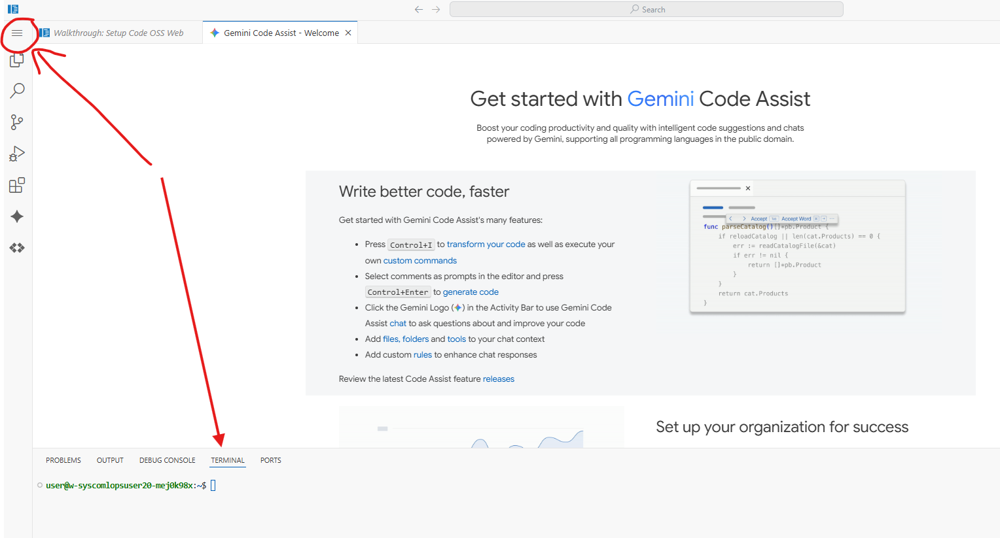

# MLOPS Model Migration Workshop – Week 2: Core Architecture - Hands-On Workshop

---

## Module Learning Objectives

By the end of this workshop, participants will be able to:

- Compare and contrast AWS and Google Cloud global infrastructure architectures
- Explore topologies across both platforms
- Map AWS services to Google Cloud service equivalents for AI/ML pipeline workloads

---

## Prerequisites

- Completion of Module 1: Cost Optimization
- AWS Management Console access with infrastructure permissions
- Google Cloud Console access with project access rights

---

## Workshop Overview

This hands-on workshop builds upon the cost management foundation from Module 1 to establish the technical architecture knowledge required for successful AWS to Google Cloud ML migrations. Using **console interfaces** and **CloudShell**, participants will gain practical experience with infrastructure services, networking, and IAM configurations across both platforms.

---

## Module 1: AWS Global Infrastructure and Core Resources

# 🧪 Lab 2.1: AWS Regions and Availability Zones Architecture Deep Dive

**Duration:** 45 minutes
**Objective:** Explore AWS global infrastructure and availability zone design using CLI and console-based inspection—without finalizing resource creation.

---

## 1. Prerequisites

- AWS Management Console access with EC2 and CloudShell permissions

- AWS CLI available via CloudShell or local environment

- Familiarity with basic AWS terminology (Region, AZ, CLI)

- No EC2 instance creation required

---

## 2. Theory Overview

- AWS infrastructure is organized into regions and availability zones

- Each region is a geographically isolated location with multiple AZs

- Availability Zones are independent failure domains within a region

- Opt-in regions must be manually enabled before use

- High availability strategies use multiple AZs to ensure fault tolerance

---

## 3. Hands-On Exploration Steps (Do Not Finalize Resources)

### 10. Access AWS Console

- Navigate to [AWS Console](https://799101906606.signin.aws.amazon.com/console)

- Launch CloudShell from the top navigation bar

### 11. Explore Available Regions

- Run: `aws ec2 describe-regions --output table`

- Run: `aws ec2 describe-regions --query 'Regions[*].[RegionName,OptInStatus]' --output table`

- Identify which regions require opt-in

### 12. Explore Availability Zones

- Run: `aws ec2 describe-availability-zones --output table`

- Run: `aws ec2 describe-availability-zones --region us-east-1 --output table`

- Observe zone names and states

### 13. Inspect Region Selector in EC2 Console

- Navigate to **EC2 > Instances > Launch Instance**

- Use the region dropdown to compare AZ counts

- Cancel before launching any instance

### 14. Sketch Region-to-Zone Mapping

- Identify 3 regions and list their AZs

- Note differences in zone naming and availability

---

## 4. Deliverables

- Table of AWS Regions and Opt-In status

- List of AZs for `us-east-1` and two other regions

- Notes on regional design considerations and zone distribution

---

## 5. Supplemental Materials

- Runbook: `runbooks/aws-region-az-exploration.md`

- Playbook: `playbooks/aws-ha-topology-strategy.md`

---

## 6. Notes and Warnings

- Do not launch EC2 instances or other resources during this lab

- AZ names (e.g., `us-east-1a`) are account-specific and may vary

- Opt-in regions may require manual activation before use

---

## 7. Verification Source

- Validated against [AWS EC2 Regions and AZs Documentation](https://docs.aws.amazon.com/AWSEC2/latest/UserGuide/using-regions-availability-zones.html)

---

# 🧪 Lab 2.2: AWS Edge Locations and CloudFront Global Network Exploration

**Duration:** 45 minutes
**Objective:** Explore AWS’s global content delivery infrastructure using CloudFront and edge location metadata—without deploying distributions or modifying resources.

---

## 1. Prerequisites

- AWS Management Console access with CloudFront and CloudShell permissions

- AWS CLI available via CloudShell or local environment

- Basic understanding of CDN concepts (edge location, origin, cache)

- No CloudFront distribution creation required

---

## 2. Theory Overview

- AWS CloudFront is a content delivery network (CDN) that uses a global network of edge locations

- Edge locations cache content closer to users to reduce latency

- Regional edge caches act as mid-tier caches between origin and edge locations

- CloudFront integrates with other AWS services like S3, EC2, and Lambda@Edge

- Edge locations are distributed across major cities and regions worldwide

---

## 3. Hands-On Exploration Steps (Do Not Finalize Resources)

### 10. Access AWS Console

- Navigate to [AWS Console](https://799101906606.signin.aws.amazon.com/console)

- Launch CloudShell from the top navigation bar

### 11. Explore Edge Location Metadata

- Run: `aws cloudfront list-distributions --output json`

- If no distributions exist, proceed to inspect global infrastructure

- Run: `aws cloudfront get-distribution-config --id <distribution-id>` (only if read-only distributions exist)

### 12. Review Global Edge Network

- Navigate to **CloudFront > Locations** in AWS Console

- Observe map of edge locations and regional edge caches

- Note geographic distribution and latency zones

### 13. Inspect CloudFront Console

- Navigate to **CloudFront > Distributions**

- Select any existing distribution (if available)

- Review origin settings, cache behaviors, and edge associations

- Do not create or modify any distributions

### 14. Compare Edge Location Coverage

- Identify 3 cities with edge locations from the AWS map : https://aws.amazon.com/about-aws/global-infrastructure/

- Note proximity to major user populations

- Record latency benefits and strategic placement rationale

---

## 4. Deliverables

- List of global edge locations and regional edge caches

- Summary of CloudFront distribution architecture (if read-only access available)

- Notes on geographic distribution and latency optimization strategy

---

## 5. Supplemental Materials

- Runbook: `runbooks/aws-cloudfront-edge-location-inspection.md`

- Playbook: `playbooks/aws-global-cdn-strategy.md`

---

## 6. Notes and Warnings

- Do not create or modify CloudFront distributions during this lab

- Edge location availability may vary by region and account

- CLI output may be empty if no distributions exist—this is expected

---

## 7. Verification Source

- Validated against [AWS CloudFront Documentation](https://docs.aws.amazon.com/AmazonCloudFront/latest/DeveloperGuide/Introduction.html)

---

# 🧪 Lab 2.3: Google Cloud Regions and Zones Architecture Analysis

**Duration:** 45 minutes
**Objective:** Explore Google Cloud’s global infrastructure, focusing on regions, zones, and service availability—without deploying any resources.

---

## 1. Prerequisites

- Google Cloud Console access with project-level permissions

- Cloud Shell enabled

- Basic understanding of cloud infrastructure concepts

- Ensure the Compute Engine API is enabled for your project

- No VM instance creation required

---

## 2. Theory Overview

- Google Cloud has over 40 regions and 100+ zones globally

- Each region is a geographic location containing multiple isolated zones

- Zones are independent failure domains connected via Google’s private high-speed network

- Most regions contain three or more zones housed in separate physical facilities

- Service availability may vary by region and zone

---

## 3. Hands-On Exploration Steps (Do Not Finalize Resources)

### 11. Access Google Cloud Console

- Navigate to [Google Cloud Console](https://console.cloud.google.com)

- Use the Project Picker to select your project

### 12. Activate Cloud Shell or Use Cloud Workstations

- Enter Workstations in the search bar.

- Select Create workstation

- Enter a unique display name

- Select test-configuration

- In the configuration field drop down, select test-configuration

- Select Create. Note: Creation may take several minutes to complete.

- Select Start, located in the All workstations section, below the Quick actions column. Note: Creation may take several minutes to complete.

- Select Launch, afterwards, using the new workstation select the menu icon to access options, select terminal from the options.

- Review the terminal area.

### 13. Explore Regions and Zones via CLI

- Run: `gcloud auth login`

- Select the clickable link. Afterwards, select Open, upon selection a new browser session will start. Follow the prompts in the new session to login and get a verification code.

- Select Continue

- Follow the prompts and provide username or password if required.

- Select Copy. Note: The credential is a verfication code.

- Paste the verification code into the terminal

- Run: `gcloud config set project mfav2-374520`

- Run: `gcloud compute regions list --format="table(name,status,zones.len():label=ZONES)"`

- Run: `gcloud compute regions describe us-east1`

- Run: `gcloud compute zones list --format="table(name,region,status)"`

- Run: `gcloud compute zones list --filter="region:us-east1" --format="table(name,status)"`

### 14. Inspect Region-Zone Mapping via Console

- Navigate to **Compute Engine > VM instances > Create Instance**

- Use the Region dropdown to view available zones

- Cancel before deploying any instance

### 15. Check Service Availability

- Run: `gcloud ai models list --region=us-east1 2>/dev/null || echo "Vertex AI not available in this region"`

- Run: `gcloud compute machine-types list --zones=us-east1-a --filter="name:n1-standard"`

---

## 4. Deliverables

- Region and zone availability matrix

- Notes on service availability for Vertex AI and machine types

- Observations on zone distribution and naming conventions

---

## 5. Supplemental Materials

- Runbook: `runbooks/gcp-region-zone-exploration.md`

- Playbook: `playbooks/gcp-multi-zone-deployment-strategy.md`

---

## 6. Notes and Warnings

- Do not finalize VM creation during this lab

- Zone names (e.g., `us-central1-a`) may vary by region and project

- Some services are region-specific—verify availability before planning deployments

---

## 7. Verification Source

- Validated against [Google Cloud Regions and Zones Documentation](https://cloud.google.com/compute/docs/regions-zones)
---

# 🧪 Lab 2.4: Google Cloud Edge Network and Cloud CDN Exploration

**Duration:** 45 minutes  
**Objective:** Explore Google Cloud’s edge infrastructure and understand how Cloud CDN accelerates content delivery using globally distributed edge locations—without finalizing resource creation.

---

## 1. Prerequisites

- Google Cloud Console access with project-level permissions  

- Cloud Shell enabled or Cloud Workstations created and launched

- Basic understanding of networking and CDN principles  

- Ensure the Cloud CDN API is enabled for your project  

- No load balancer or backend service creation required  

---

## 2. Theory Overview

- Google Cloud’s edge network includes over 200 edge locations globally  

- Edge PoPs (Points of Presence) cache and serve content closer to users  

- Cloud CDN integrates with HTTP(S) Load Balancing to deliver content via edge caches  

- CDN reduces latency, offloads origin servers, and improves user experience  

---

## 3. Hands-On Exploration Steps (Do Not Finalize Resources)

### 10. Access Google Cloud Console

- Navigate to [Google Cloud Console](https://console.cloud.google.com)  

- Select your project using the Project Picker  

### 11. Activate Cloud Shell or Utilize Cloud Workstations

- Note: If you cannot launch the cloud shell or encounter warnings or errors, use cloud workstations.

- Review the previous instructions for lab 2.3, task number 12 and 13. Note: If you did not delete the cloud workstation, continue by selecting start for the stopped workstation and then select launch.

### 12. Review Edge Location Coverage

- Visit [Google Cloud CDN Locations](https://cloud.google.com/cdn/docs/locations)  

- Note geographic distribution and latency zones  

### 13. Navigate to Cloud CDN

- Search for **Cloud CDN**  

- Click **Add origin**  

- In the Define your backend bucket section, Select **Browse** from the Cloud Storage bucket field.  

- In the Select bucket side panel, select **groundeddiabetes**. Afterwards choose **Select**

- In the Origin name field, enter a unique name.

- Select **Next**

- Select the **Create new load balancer for me** button

- Enter a unique name in the **Load Balancer name** field.

- Select **Next**

- Review Cache Performance **Basic options** 

- Review cache key and TTL settings  

- Cancel configuration before saving  

### 15. Inspect Existing CDN-Enabled Backends (if available)

- Run: gcloud compute backend-services list --filter="cdnPolicy.enable:true" --format="table(name,protocol,cdnPolicy.cacheMode)"

4. Deliverables

- Notes on CDN activation and configuration

- Observations on cache behavior and latency

Summary of edge location coverage and performance benefits

5. Supplemental Materials

- Runbook: runbooks/gcp-cloud-cdn-exploration.md

- Playbook: playbooks/gcp-edge-network-strategy.md

6. Notes and Warnings

- Do not finalize load balancer or backend service creation during this lab

- Cloud CDN only works with HTTP(S) load balancers

- Edge locations are managed by Google and not directly configurable

- Cache behavior may vary based on content type and headers

7. Verification Source

- Validated against Google Cloud CDN Documentation: [Google Cloud CDN & Edge ](https://cloud.google.com/cdn/docs/overview)

---

# 🧪 Lab 2.5: EC2 Instance Types and Sizing for ML Workloads

**Objective:** Explore EC2 instance families optimized for machine learning workloads, focusing on sizing strategies, accelerator options, and pricing—without launching any instances.

---

## 1. Prerequisites

- AWS Console access with read-only permissions  

- Familiarity with EC2 concepts and ML workload characteristics  

- No EC2 instance launch or billing-incurring actions required  

- AWS CLI installed in CloudShell or local environment  

---

## 2. Theory Overview

- ML workloads vary in compute, memory, and accelerator needs  

- EC2 instance families include general purpose, compute optimized, memory optimized, and accelerated computing  

- GPU-based instances (e.g., `p4`, `g5`) are ideal for training deep learning models  

- Inferentia-based instances (e.g., `inf1`) are optimized for inference  

- Sizing depends on model complexity, batch size, and training duration  

---

## 3. Hands-On Exploration Steps (Do Not Launch Instances)

### 10. Access AWS Console

- Navigate to [AWS EC2 Dashboard](https://console.aws.amazon.com/ec2/)  

- Select **Instances > Launch Instance**  

- Cancel before finalizing any configuration  

### 11. Explore Instance Types

- Go to **Instance Types** tab  

- Filter by **Accelerated Computing**  

- Review specs for `p4d`, `g5`, `inf1`, and `trn1`  

### 12. Use AWS CLI to List ML-Optimized Instances

- Run:  
`aws ec2 describe-instance-types \
  --filters Name=processor-info.supported-gpus,Values=*"NVIDIA"* \
  --query 'InstanceTypes[*].InstanceType' \
  --output table`
  
13. Review Pricing and Regional Availability
Visit AWS Pricing Calculator

Compare hourly costs for GPU vs CPU instances

Note availability zones for ML-optimized types

14. Examine Instance Limits
Go to Limits tab in EC2 Dashboard

Check quotas for GPU instances in your region

4. Deliverables
Summary of instance types suitable for ML training vs inference

Notes on pricing, accelerator support, and regional availability

CLI output showing GPU-enabled instance types

5. Supplemental Materials
Runbook: runbooks/aws-ec2-ml-sizing.md

Playbook: playbooks/aws-ml-instance-selection.md

6. Notes and Warnings
Do not launch EC2 instances during this lab

GPU instances may have limited availability in some regions

Pricing varies significantly based on accelerator type and tenancy

Always validate instance compatibility with ML frameworks (e.g., TensorFlow, PyTorch)

7. Verification Source
Verified against AWS EC2 Instance Types and Accelerated Computing Guidance

---

# 🧪 Lab 2.6: S3 Storage Classes and Lifecycle Management

**Duration:** 30 minutes  
**Objective:** Explore Amazon S3 storage tiers and lifecycle rule configurations to optimize cost for ML datasets—without finalizing resource creation.

---

## 1. Prerequisites

- AWS Management Console access with S3 permissions  

- CloudShell or AWS CLI enabled  

- Sample bucket available or simulated for exploration  

- Familiarity with object storage concepts and cost optimization strategies  

- No lifecycle rule creation or bucket modification required  

---

## 2. Theory Overview

- Amazon S3 offers multiple storage classes tailored to access patterns and cost  

- Lifecycle rules automate transitions and deletions based on object age or tags  

- Storage Class Comparison:  

| Storage Class               | Use Case                          | Durability         | Availability | Retrieval Time     | Cost (per GB/month) |
|----------------------------|-----------------------------------|--------------------|--------------|--------------------|----------------------|
| Standard                   | Frequent access                   | 99.999999999%      | 99.99%       | Immediate          | High                 |
| Intelligent-Tiering        | Unknown/changing access patterns  | 99.999999999%      | 99.9–99.99%  | Immediate          | Variable             |
| Standard-IA                | Infrequent access                 | 99.999999999%      | 99.9%        | Immediate          | Lower                |
| One Zone-IA                | Infrequent, single AZ             | 99.999999999%      | 99.5%        | Immediate          | Lowest IA            |
| Glacier                    | Archival, occasional retrieval    | 99.999999999%      | N/A          | Minutes–hours      | Very low             |
| Glacier Deep Archive       | Long-term archival                | 99.999999999%      | N/A          | Hours              | Lowest               |

---

## 3. Hands-On Exploration Steps (Do Not Finalize Resources)

### 9. Access S3 Console

- Navigate to [S3 Buckets](https://console.aws.amazon.com/s3)  

- Select or simulate a bucket (e.g., `ml-training-data`)  

### 10. Open the Management Tab

- Click the bucket name  

- Navigate to **Management > Lifecycle rules**  

- Click **Create lifecycle rule**  

### 11. Explore Lifecycle Rule Configuration

- Rule name: `ml-lifecycle-demo`  

- Filter: Prefix = `ml-data/`  

- Transitions:  
  - Move to Standard-IA after 30 days  
  - Move to Glacier after 90 days  

- Expiration: Delete after 365 days  

- Cancel before saving  

### 12. Review Pricing

- Visit [S3 Pricing](https://aws.amazon.com/s3/pricing/)  

- Compare cost for storing 1 TB over 12 months across classes  

### 13. Inspect Existing Lifecycle Rules (Optional)

- Run:
`aws s3api get-bucket-lifecycle-configuration --bucket [YOUR_BUCKET_NAME]`

4. Deliverables
Summary of lifecycle rule configuration explored

Pricing comparison table for storage classes

CLI output of existing lifecycle rules (if applicable)

5. Supplemental Materials
Runbook: runbooks/aws-s3-lifecycle-exploration.md

Playbook: playbooks/aws-storage-optimization-strategy.md

6. Notes and Warnings
Do not finalize lifecycle rule creation during this lab

Lifecycle transitions may incur retrieval fees—review pricing carefully

Use tags and prefixes to scope rules narrowly in production environments

7. Verification Source
Verified against Amazon S3 Lifecycle Configuration Documentation

---

# 🧪 Lab 2.7: Compute Engine Machine Types and Custom Configurations

**Duration:** 30 minutes  
**Objective:** Explore Google Cloud Compute Engine machine families, sizing strategies, and custom VM configurations for ML workloads—without finalizing resource creation.

---

## 1. Prerequisites

- Google Cloud Console access with Compute Engine permissions  

- Cloud Shell enabled  

- Familiarity with VM sizing and ML workload characteristics  

- Billing enabled (for simulation only—no resource creation)  

- No VM instance creation required  

---

## 2. Theory Overview

- Compute Engine offers predefined and custom machine types across multiple families  

- General-purpose families (E2, N2, N2D, N4) support custom configurations  

- Accelerator-optimized families (G2) support GPU workloads  

- Custom machine types allow fine-grained control over vCPU and memory  

- Extended memory is available for select series with pricing implications  

---

## 3. Hands-On Exploration Steps (Do Not Finalize Resources)

### 10. Access Compute Engine Console

- Navigate to [Compute Engine > VM Instances](https://console.cloud.google.com/compute/instances)  

- Click **Create Instance** (do not complete creation)  

### 11. Explore Machine Type Options

- Under **Machine configuration**, review:  

  - Series: E2, N2, N2D, N4  

  - Preset types: standard, highmem, highcpu  

  - Click **Customize** to manually set vCPU and memory  

### 12. Simulate ML Workload Sizing

- Example configuration:  

  - vCPU: 8  

  - Memory: 64 GB  

  - Family: N2  

- Observe estimated monthly cost (do not proceed to deploy)  

### 13. Review GPU Options (Optional)

- Under **CPU platform and GPU**, explore G2 family  

- Note GPU types: NVIDIA L4, A100  

- Do not attach GPUs or finalize instance  

### 14. Inspect via CLI (Optional)

- Run:  
`gcloud compute machine-types list --zones=us-central1-a`

4. Deliverables
Summary of machine families and sizing options explored

Screenshot or notes from custom configuration simulation

CLI output of available machine types (if applicable)

5. Supplemental Materials
Runbook: runbooks/gcp-compute-machine-types.md

Playbook: playbooks/gcp-ml-instance-sizing-strategy.md

6. Notes and Warnings
Do not finalize VM creation during this lab

Custom configurations may affect pricing and availability

GPU instances require quota and billing setup—explore only

7. Verification Source
Verified against Google Cloud Compute Engine Documentation

---

# 🧪 Lab 2.8: Cloud Storage Classes and Object Lifecycle Management

**Duration:** 30 minutes  
**Objective:** Explore Google Cloud Storage classes and lifecycle rule configurations to optimize cost and retention for ML datasets—without finalizing resource creation.

---

## 1. Prerequisites

- Google Cloud Console access with Storage permissions  

- Cloud Shell enabled  

- Familiarity with object storage and data retention strategies  

- Billing enabled (for simulation only—no resource creation)  

- No lifecycle rule creation required  

---

## 2. Theory Overview

- Cloud Storage offers multiple classes based on access frequency and availability  

- Storage classes include: Standard, Nearline, Coldline, Archive  

- Each class has minimum storage durations and retrieval fees  

- Lifecycle rules automate transitions and deletions based on object age or conditions  

- Actions include: SetStorageClass, Delete, AbortIncompleteMultipartUpload  

---

## 3. Hands-On Exploration Steps (Do Not Finalize Resources)

### 10. Access Cloud Storage Console

- Navigate to [Cloud Storage > Buckets](https://console.cloud.google.com/storage)  

- Select or simulate a bucket (e.g., `ml-datasets`)  

### 11. Open Lifecycle Rules Panel

- Click the bucket name  

- Go to **Lifecycle** tab  

- Click **+ Add a rule**  

### 12. Explore Lifecycle Rule Configuration

- Condition: Age > 30 days  

- Action: Change storage class to Nearline  

- Add second rule:  

  - Age > 90 days → Coldline  

  - Age > 365 days → Delete  

- Cancel before saving  

### 13. Review Pricing

- Visit [Cloud Storage Pricing](https://cloud.google.com/storage/pricing)  

- Compare cost for storing 1 TB over 12 months across classes  

### 14. Inspect via CLI (Optional)

- Run:  
`gsutil lifecycle get gs://[YOUR_BUCKET_NAME]`

4. Deliverables
Summary of lifecycle rule configuration explored

Pricing comparison table for storage classes

CLI output of existing lifecycle rules (if applicable)

5. Supplemental Materials
Runbook: runbooks/gcp-storage-lifecycle-exploration.md

Playbook: playbooks/gcp-storage-optimization-strategy.md

6. Notes and Warnings
Do not finalize lifecycle rule creation during this lab

Minimum storage durations may incur early deletion fees

Lifecycle rules should be scoped carefully using conditions

7. Verification Source
Verified against Google Cloud Storage Lifecycle Documentation
