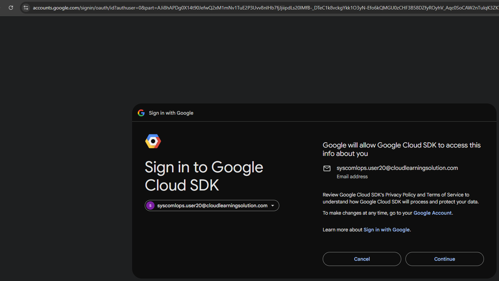

# Week 3: Identity and Access Management – Platform Enablement (Provisioning) Hands-On Workshop

# **Presenter Demonstration**
# 🧪 Lab 3.1: AWS Management Console IAM Configuration for SageMaker

**Objective:** Explore the IAM roles, trust relationships, and managed policies that enable Amazon SageMaker—without creating or modifying any IAM resources.
---

## 1. Prerequisites

- AWS Management Console access with IAM “ReadOnly” and SageMaker permissions  

- Familiarity with AWS IAM concepts (roles, policies, trust relationships)  

- No new IAM role or policy creation allowed  

---

## 2. Theory Overview

- SageMaker uses an execution role to call other AWS services on your behalf (S3, ECR, CloudWatch, etc.)  

- Execution roles require a trust policy allowing the SageMaker service principal (`sagemaker.amazonaws.com`) to assume the role  

- Common managed policies include `AmazonSageMakerFullAccess` and `AmazonS3ReadOnlyAccess`  

- The `iam:PassRole` permission is required to pass execution roles into SageMaker jobs  

---

## 3. Hands-On Exploration Steps (Do Not Finalize Resources)

- Open the AWS Console

- Search for IAM, and then select **Roles**  

- Search for **AmazonSageMaker** in the Roles list  

## 4. Review an Existing SageMaker Execution Role

- Click a role named like `AmazonSageMaker-ExecutionRole-*`  

- Select the **Trust relationships** tab  

- Confirm `Service: sagemaker.amazonaws.com` under **Trusted entities**  

## 5. Inspect Attached Policies

- Select the **Permissions** tab  

- Note managed policies such as `AmazonSageMakerFullAccess`

- Click **Policy name** → **JSON** to view actions and resources  
---

## 4. Deliverables

- List of SageMaker execution roles and their trust principals  

- Summary of key managed policies and granted actions  
---

## 5. Supplemental Materials

- IAM Roles for SageMaker Overview  
  https://docs.aws.amazon.com/sagemaker/latest/dg/security_iam_service-with-iam.html  

- SageMaker Execution Role Best Practices  
  https://docs.aws.amazon.com/sagemaker/latest/dg/build-and-manage-access.html  

---

## 6. Notes and Warnings

- Do not create, modify, or delete any IAM roles or policies  

- Viewing trust relationships and policies is read-only  

- Passing real roles without proper review can break production workflows  

---

## 7. Verification Source

- Verified against AWS SageMaker IAM documentation  
  https://docs.aws.amazon.com/sagemaker/latest/dg/security_iam_service-with-iam.html  

---

# **Presenter Demonstration**

# 🧪 Lab 3.2: AWS CLI and SDK Authentication Setup for SageMaker

**Objective:** Validate AWS CLI/SDK authentication for SageMaker by inspecting credential configurations and making read-only calls—without launching any SageMaker jobs.

---

## 1. Prerequisites

- AWS CLI v2 installed (or use AWS CloudShell)
- **SageMaker execution role** with appropriate permissions

---

## 2. Theory Overview

- **SageMaker requires specific IAM roles** for training jobs, endpoints, and notebook instances

---

## 3. SageMaker-Specific Authentication Requirements

### Key SageMaker Policies:
- `AmazonSageMakerFullAccess` - Full SageMaker permissions
- `AmazonSageMakerReadOnly` - Read-only access for monitoring
- `AmazonS3FullAccess` - Required for data access and model storage
- Custom execution roles for training jobs and endpoints

## Hands-On Exploration Steps

## 4. Check available SageMaker execution roles
- Run: `aws iam list-roles --query 'Roles[?contains(RoleName, `SageMaker`)].{RoleName:RoleName,Arn:Arn}' --output table`

## 5. Verify SageMaker service permissions
- Run: `aws sagemaker describe-domain --domain-id $(aws sagemaker list-domains --query 'Domains[0].DomainId' --output text) 2>/dev/null || echo "No SageMaker Studio domain found"`

## 6. Validate SageMaker Execution Role

- Get SageMaker execution role ARN

- Run: `ROLE_ARN=$(aws iam list-roles --query 'Roles[?contains(RoleName, `SageMaker`)].Arn | [0]' --output text)`

## 7. Verify role exists and has trust policy
- Run: `aws iam get-role --role-name $(basename $ROLE_ARN) --query 'Role.AssumeRolePolicyDocument'`

## 8. Check attached policies
- Run: `aws iam list-attached-role-policies --role-name $(basename $ROLE_ARN)`

## Notes and Warnings
- Do not create or launch any SageMaker jobs

- Avoid committing real credentials in shared scripts

- Use read-only calls to confirm permissions

## Verification Source

- Verified against AWS CLI and Boto3 documentation https://docs.aws.amazon.com/cli/latest/userguide/cli-configure-files.html

---

# 🧪 Lab 3.4: Google Cloud Console IAM Configuration for Vertex AI

**Objective:** Explore predefined and custom IAM roles for Vertex AI in the Google Cloud Console—without granting or revoking any permissions.

---

## 1. Prerequisites

- Google Cloud Console access

- Familiarity with GCP IAM concepts (roles, bindings, principals)  

- No actual role assignments or removals  

---

## 2. Theory Overview

- Vertex AI provides predefined roles such as `Vertex AI User`  

- Custom roles enable least-privilege access  

- IAM bindings link principals (users, service accounts) to roles at project or resource level  

---
## Hands-On Exploration Steps (Do Not Finalize Resources)

## 3. Open the IAM Page

- Navigate to [Google Cloud Console](https://console.cloud.google.com)

- Use the Project Picker to select your project


### 12. Activate Cloud Shell or Use Cloud Workstations

- Enter Workstations in the search bar.


- Select Create workstation

- Enter a unique display name

- Select test-configuration

- In the configuration field drop down, select test-configuration

- Select Create. Note: Creation may take several minutes to complete.

- Select Start, located in the All workstations section, below the Quick actions column. Note: Creation may take several minutes to complete.


- Select Launch, afterwards, using the new workstation select the menu icon to access options, select terminal from the options.


- Review the terminal area.

- Run: `gcloud auth login`

- Select the clickable link. Afterwards, select Open, upon selection a new browser session will start. Follow the prompts in the new session to login and get a verification code.



- Select Continue

- Follow the prompts and provide username or password if required.

- Select Copy. Note: The credential is a verfication code.


- Paste the verification code into the terminal

- Run: `gcloud config set project mfav2-374520`

- Navigate back to the Google Cloud Console

- Search for IAM

- Observe project-level IAM principals and their bindings

## 4: Filter for AI/ML Roles
- Click **Filter** → Enter **Role**
- Enter `Vertex AI` to see Vertex AI roles
- Select `Vertex AI User` to see role binded to principal

## 5: Examine Vertex AI Role Details
- Click on **Roles** in the navigation nodes
- In the field after Filter, Enter `Vertex AI Administrator`, and then select it.
- Review **assigned permissions** note permissions like:
  - `aiplatform.datasets.list`
  - `aiplatform.trainingjobs.create`
  - `aiplatform.models.predict`
 
## 6: Examine Service Accounts
- Navigate to **IAM**
- Click **Filter** → Enter **Role**
- Enter `Vertex AI` to see Vertex AI roles
- Select `Vertex AI Administrator` to see role binded to principals
- Review principal named: `github-actions-runner@mfav2-374520.iam.gserviceaccount.com`
- Review principal named: `vertex-pipeline-executor@mfav2-374520.iam.gserviceaccount.com`
- Review each principals Role and Conditions.
---

# 🧪 Lab 3.5: gcloud CLI and SDK Authentication Setup for Vertex AI

**Objective:** Verify gcloud CLI and SDK for Vertex AI calls—without modifying project-level IAM.

---

## 1. Prerequisites

- Google Cloud SDK installed or use Cloud Shell  

- Vertex AI API enabled for your project  

- No changes to service accounts or roles  

---

## 2. Theory Overview

- gcloud CLI uses user credentials via `gcloud auth login`  

- ADC supports `gcloud auth application-default login` for client libraries  

- Commands inherit credentials from the active gcloud context or ADC  

---

## 3. Hands-On Exploration Steps (Do Not Finalize Resources)

### 10. Check Active gcloud Credentials

- Run: `gcloud auth list`
- Run: `gcloud config list project`

---

# 🧪 Lab 3.6: Vertex AI Service Account and Role Management

**Duration:** 30 minutes  
**Objective:** Examine service accounts used by Vertex AI and the IAM bindings granting them roles—without creating or deleting any service accounts. Includes Terraform-based provisioning steps for current and new GCP projects.

---

## 1. Prerequisites

- Google Cloud Console & Cloud Shell access  

- IAM Viewer and Service Account Admin (read-only) roles  

- Vertex AI APIs enabled  

- Terraform CLI installed and authenticated via ADC or service account impersonation  

---

## 2. Theory Overview

- Vertex AI uses managed service agents (e.g., `service-PROJECT_NUMBER@gcp-sa-aiplatform.iam.gserviceaccount.com`)  

- Custom training and prediction jobs run under user-managed or default service accounts  

- Common roles bindings include `roles/aiplatform.admin`, `roles/iam.serviceAccountUser`, and `roles/storage.objectViewer`  

- Terraform can provision service accounts and bind IAM roles across one or more projects  

---

## 3. Hands-On Exploration Steps (Do Not Finalize Resources)

### 10. List Service Accounts

- Run:  `gcloud iam service-accounts list`

Note managed agent and user-created accounts

11. Inspect IAM Bindings
- Run:

```
gcloud projects get-iam-policy YOUR_PROJECT_ID \
--format="table(bindings.role, bindings.members)"
```
Filter for the service account email

11. View Default Vertex AI Service Agent
    
In the Console, go to IAM → search gcp-sa-aiplatform

Inspect roles granted (e.g., Vertex AI Service Agent)

13. Simulate Creating a Custom Service Account
In the Console, go to IAM & Admin → Service Accounts → Create Service Account

Review form fields (do not click Create)

4. Vertex AI Service Account Provisioning with Terraform

- Step 1: Verify Cloud Workstation Setup
- bash# Verify you're authenticated
- Run
```gcloud auth list```

- # Set the project (should already be set in workstation)
- Run
```gcloud config set project mfav2-374520```

- # Verify project access
-Run
```gcloud projects describe mfav2-374520```

- Step 2: Install/Verify Terraform
# Install required packages first
- Run: ```sudo apt-get update```
- Run: ```sudo apt-get install -y software-properties-common gnupg lsb-release wget```

# Add HashiCorp GPG key
- Run: ```wget -O- https://apt.releases.hashicorp.com/gpg | sudo gpg --dearmor -o /usr/share/keyrings/hashicorp-archive-keyring.gpg```

# Add HashiCorp repository manually
- Run:
```echo "deb [signed-by=/usr/share/keyrings/hashicorp-archive-keyring.gpg] https://apt.releases.hashicorp.com $(lsb_release -cs) main" | sudo tee /etc/apt/sources.list.d/hashicorp.list```

# Update package list
- Run:
```sudo apt-get update```

# Install Terraform
- Run:
```sudo apt-get install -y terraform```

# Verify installation
- Run:
```terraform version```

# Part 1: Review Existing Service Accounts
## List Vertex AI Service Acconts
- Look specifically for the ones mentioned in the configuration
- Run: ```gcloud iam service-accounts describe github-actions-runner@mfav2-374520.iam.gserviceaccount.com --project=mfav2-374520```

- Run: ```gcloud iam service-accounts describe vertex-pipeline-executor@mfav2-374520.iam.gserviceaccount.com --project=mfav2-374520```

## Step 4: Check Existing IAM Bindings
- Check what roles the existing service accounts have
```gcloud projects get-iam-policy mfav2-374520 --flatten="bindings[].members" --format="table(bindings.role)" --filter="bindings.members:github-actions-runner@mfav2-374520.iam.gserviceaccount.com"```

```gcloud projects get-iam-policy mfav2-374520 --flatten="bindings[].members" --format="table(bindings.role)" --filter="bindings.members:vertex-pipeline-executor@mfav2-374520.iam.gserviceaccount.com"```

## Step: Generate Service Account Key
- Create key for the terraform-ops service account
```gcloud iam service-accounts keys create ~/terraform-ops-key.json --iam-account=terraform-ops@mfav2-374520.iam.gserviceaccount.com```

- Activate the service account
```gcloud auth activate-service-account --key-file=terraform-ops-key.json```

- Set as active account
```gcloud config set account terraform-ops@mfav2-374520.iam.gserviceaccount.com```

- Verify the switch
```gcloud auth list```
```gcloud config get-value account```
- Step 2: Test Service Account Permissions

```gcloud iam service-accounts create test-creation-check --display-name="Test Creation" --project=mfav2-374520```

- If successful, delete the test service account
```gcloud iam service-accounts delete test-creation-check@mfav2-374520.iam.gserviceaccount.com --project=mfav2-374520 --quiet```

# Part 2: Create Terraform Configuration
## Step 5: Create Working Directory
- Create a directory for the Terraform training
```mkdir ~/terraform-training```
```cd ~/terraform-training```

## Step 6: Create Main Terraform File
```bash
cat > main.tf << 'EOF'
# Terraform Service Account Training - Multi-Student Version
# Instructions:
# 1. Set GOOGLE_APPLICATION_CREDENTIALS environment variable to your key file path
#    Example: export GOOGLE_APPLICATION_CREDENTIALS=~/terraform-ops-key.json
# 2. Replace YOUR_INITIALS and YOUR_NUMBER in terraform.tfvars

terraform {
  required_providers {
    google = {
      source  = "hashicorp/google"
      version = "~> 5.0"
    }
  }
}

provider "google" {
  # Uses credentials from GOOGLE_APPLICATION_CREDENTIALS environment variable
  project = var.project_id
  region  = var.region
}

# Variables
variable "project_id" {
  description = "The GCP project ID"
  type        = string
  default     = "mfav2-374520"
}

variable "region" {
  description = "The GCP region"
  type        = string
  default     = "us-east1"
}

variable "student_initials" {
  description = "Student initials for unique naming (e.g., jd, ms, ab)"
  type        = string
  validation {
    condition     = can(regex("^[a-z]{2,4}$", var.student_initials))
    error_message = "Student initials must be 2-4 lowercase letters only."
  }
}

variable "student_number" {
  description = "Student number for additional uniqueness (01-99)"
  type        = string
  validation {
    condition     = can(regex("^[0-9]{2}$", var.student_number))
    error_message = "Student number must be exactly 2 digits (01-99)."
  }
}

# Local values for consistent naming
locals {
  name_prefix  = "${var.student_initials}${var.student_number}"
  github_sa_id = "github-actions-${local.name_prefix}"
  vertex_sa_id = "vertex-pipeline-${local.name_prefix}"
}

# GitHub Actions Runner Service Account
resource "google_service_account" "github_actions_runner_training" {
  account_id   = local.github_sa_id
  display_name = "GitHub Actions Runner (${upper(var.student_initials)}${var.student_number})"
  description  = "Service account for GitHub Actions CI/CD pipeline - Student ${upper(var.student_initials)}${var.student_number}"
}

# Vertex AI Pipeline Executor Service Account
resource "google_service_account" "vertex_pipeline_training" {
  account_id   = local.vertex_sa_id
  display_name = "Vertex AI Pipeline Executor (${upper(var.student_initials)}${var.student_number})"
  description  = "Service account for Vertex AI pipeline execution - Student ${upper(var.student_initials)}${var.student_number}"
}

# GitHub Actions IAM Roles
resource "google_project_iam_member" "github_actions_permissions" {
  for_each = toset([
    "roles/viewer",
    "roles/iam.serviceAccountUser",
    "roles/storage.objectViewer",
    "roles/logging.viewer",
    "roles/source.reader"
  ])

  project = var.project_id
  role    = each.key
  member  = "serviceAccount:${google_service_account.github_actions_runner_training.email}"
}

# Vertex AI IAM Roles
resource "google_project_iam_member" "vertex_pipeline_permissions" {
  for_each = toset([
    "roles/aiplatform.user",
    "roles/storage.objectAdmin",
    "roles/bigquery.dataEditor",
    "roles/artifactregistry.reader",
    "roles/logging.writer"
  ])

  project = var.project_id
  role    = each.key
  member  = "serviceAccount:${google_service_account.vertex_pipeline_training.email}"
}

# Outputs
output "student_identifier" {
  description = "Your unique student identifier"
  value       = "${upper(var.student_initials)}${var.student_number}"
}

output "github_actions_service_account_email" {
  description = "Email of the created GitHub Actions service account"
  value       = google_service_account.github_actions_runner_training.email
}

output "vertex_pipeline_service_account_email" {
  description = "Email of the created Vertex AI pipeline service account"
  value       = google_service_account.vertex_pipeline_training.email
}

output "service_account_names" {
  description = "Created service account names for reference"
  value = {
    github_actions  = local.github_sa_id
    vertex_pipeline = local.vertex_sa_id
  }
}

output "github_actions_permissions" {
  description = "Roles assigned to GitHub Actions service account"
  value       = keys(google_project_iam_member.github_actions_permissions)
}

output "vertex_pipeline_permissions" {
  description = "Roles assigned to Vertex AI pipeline service account"
  value       = keys(google_project_iam_member.vertex_pipeline_permissions)
}
EOF
```

- Create Variables File

```bash
cat > terraform.tfvars << 'EOF'
# Student Configuration File
# IMPORTANT: Update these values with your information

# Replace with your initials (2–4 lowercase letters)
student_initials = "YOUR_INITIALS"

# Replace with your assigned student number (01–99)
student_number = "YOUR_NUMBER"

# Project and region (leave as-is unless instructed otherwise)
project_id = "mfav2-374520"
region     = "us-east1"
EOF
```
