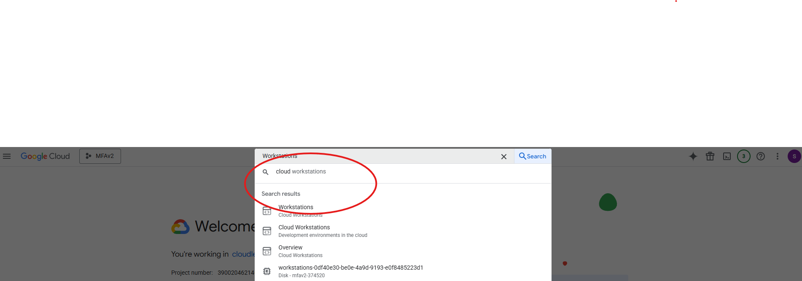
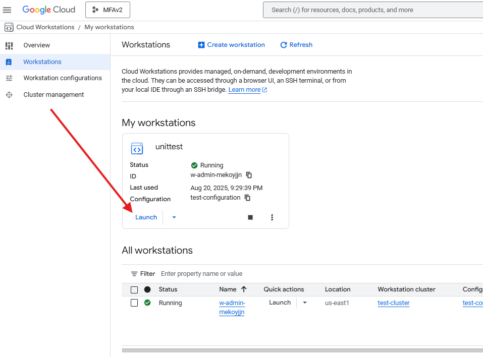

# Machine Learning Operations Playbook Adoption Workshop – Week 4: Network Configuration and VPC Setup - Hands-On Workshop

## Objectives

## Overview

This week focuses on network configuration and VPC setup for ML platforms. AWS labs provide high-level exploration, while Google Cloud labs deliver deep technical implementation.

## Prerequisites
### AWS Requirements

- AWS hands on demonstrated by presenter. Attendees do not require access.

### Google Cloud Requirements

- Google Cloud Console access with Network Admin role
- Cloud Workstations
- Vertex AI API enabled
- Billing account configured

# 🧪 Lab 4.1: AWS VPC Design and Implementation for SageMaker

**Objective:** Understand how Amazon SageMaker integrates with Amazon VPCs to isolate ML workloads and enable secure communication with AWS services.

---

## 1. Prerequisites

- AWS Console access with SageMaker and VPC permissions  
- No resource creation required (exploration-only)  
- Familiarity with basic VPC concepts: subnets, route tables, security groups  

---

## 2. Theory Overview

- SageMaker domains can be configured to run in **VPC-only mode** for full network isolation  
- You must specify subnets, security groups, and optionally VPC endpoints for services like S3 and CloudWatch  
- VPC-only mode disables public internet access and routes all traffic through your defined VPC  

---

## 3. Hands-On Exploration Steps

### 10. Navigate to SageMaker Domain Setup

- Go to [Amazon SageMaker Console](https://console.aws.amazon.com/sagemaker/)  
- Click **Domains** → **Explore domain settings**

### 11. Review Network Configuration Options

- Under **Network**  
- Observe required fields:  
  - VPC ID  
  - Subnet IDs (must be private)  
  - Security Group IDs  

### 12. Explore VPC Console

- Open [Amazon VPC Console](https://console.aws.amazon.com/vpc/)  
- Review existing VPCs and subnets 

---

## 4. Deliverables

- Notes of SageMaker domain network configuration  
- List of required VPC components for VPC-only mode  

---

## 5. Supplemental Materials

- [Choosing an Amazon VPC for SageMaker](https://docs.aws.amazon.com/sagemaker/latest/dg/onboard-vpc.html)
 
# 🧪 Lab 4.2: Security Groups and Network ACLs for ML Workloads

**Objective:** Explore how security groups and network ACLs control traffic to ML workloads in Amazon VPCs.

---

## 1. Prerequisites

- AWS Console access with EC2 and VPC permissions  
- No instance launch required  

---

## 2. Theory Overview

- **Security Groups**: Stateful, instance-level firewalls  
- **Network ACLs**: Stateless, subnet-level firewalls  
- Security groups allow inbound/outbound rules per protocol and port  
- Network ACLs allow and deny rules based on CIDR, protocol, and port  

---

## 3. Hands-On Exploration Steps

### 4. Open EC2 Security Groups

- Go to [EC2 Console](https://console.aws.amazon.com/ec2/)  
- Click **Security Groups** → Select any group  

### 5. Review Inbound and Outbound Rules

- Note rules for ports like 22 (SSH), 443 (HTTPS), 8888 (Jupyter)  
- Observe CIDR ranges and protocol types  

### 6. Open VPC Network ACLs

- Go to [VPC Console](https://console.aws.amazon.com/vpc/)  
- Click **Network ACLs** → Select any ACL  

### 7. Compare ACL Rules

- Note allow/deny rules  
- Observe stateless behavior (return traffic must be explicitly allowed)  

---

## Deliverables

- Table comparing security group vs network ACL rules  
- Notes on rule behavior and ML workload implications  

---

## Supplemental Materials

- [Security Groups and Network ACLs Best Practices](https://docs.aws.amazon.com/whitepapers/latest/aws-best-practices-ddos-resiliency/security-groups-and-network-acls-bp5.html)


# 🧪 Lab 4.3: VPC Endpoints and Private Connectivity Configuration

**Objective:** Explore how VPC interface endpoints enable private connectivity to SageMaker APIs and runtimes using AWS PrivateLink.

---

## 1. Prerequisites

- AWS Console access with VPC and SageMaker permissions  
- No endpoint creation required  

---

## 2. Theory Overview

- VPC endpoints allow private access to AWS services without internet exposure  
- SageMaker supports **interface endpoints** via AWS PrivateLink  
- Private DNS can be enabled to resolve SageMaker endpoints internally  

---

## 3. Hands-On Exploration Steps

### 10. Open VPC Console → Endpoints

- Go to [VPC Console](https://console.aws.amazon.com/vpc/)

- Click **Endpoints** → **Create Endpoint**  

### 11. Explore SageMaker Services

- Search for services:  
  - `com.amazonaws.region.sagemaker.api` 

# 🧪 Lab 4.4: Google Cloud VPC Design and Implementation for Vertex AI
 
**Objective:** Design and configure a secure VPC environment that enables Vertex AI pipeline components to access Google Cloud Storage and BigQuery using Private Google Access—without relying on external IPs or public internet routing.

---

## 1. Prerequisites

- Google Cloud Console access with Compute Network Admin and Vertex AI Admin roles  
- Vertex AI API enabled  
- Cloud Workstations  
- Existing Vertex AI pipeline deployed  

---

## 2. Theory Overview

- **Private Google Access** allows managed resources in private subnets to access Google APIs (e.g., GCS, BigQuery) without external IPs  
- **Vertex AI pipeline components** often run on managed infrastructure that uses internal IPs only  
- Enabling Private Google Access ensures secure, compliant access to datasets, models, and metadata stored in GCS and BigQuery  
- This configuration is critical for components like `preprocess_data_op`, `train_model_op`, `evaluate_model_op`, `model_approved_op`, and `register_model_op`  
- The only component that does not require GCS access is `model_rejected_op`  

---

## 3. Hands-On Implementation Steps

## Overview

These labs teach you how to configure Private Google Access so your Vertex AI pipeline components can securely access Cloud Storage and BigQuery without using the public internet.

### Pipeline Components That Need Access

| Component | What It Does | Needs GCS/BigQuery? |
|-----------|-------------|---------------------|
| `preprocess_data_op` | Downloads raw data | ✅ Yes - Direct GCS access |
| `train_model_op` | Trains the model | ✅ Yes - Reads/writes artifacts |
| `evaluate_model_op` | Evaluates model performance | ✅ Yes - Reads data, writes metrics |
| `model_approved_op` | Logs approved models | ✅ Yes - Reads model metadata |
| `register_model_op` | Registers model version | ✅ Yes - Reads artifact paths |
| `model_rejected_op` | Logs rejection | ❌ No - Only logging |

---

## 🧪 Lab 4.4: Google Cloud VPC Design and Implementation for Vertex AI

**Duration:** 45 minutes  
**Objective:** Build a private VPC that lets your existing Vertex AI pipeline components reach Cloud Storage and BigQuery over Google's internal network by enabling Private Google Access.

---

### 1. Prerequisites

- Project Owner or Compute Network Admin & Vertex AI Admin  
- Vertex AI, Cloud Storage & BigQuery APIs enabled  
- Cloud Shell or local `gcloud` CLI authenticated  
- An existing Vertex AI pipeline deployed (or pipeline spec in hand)  
- Pipeline service account granted `roles/storage.objectViewer`/`Admin` and BigQuery Data Viewer/Editor  

---

### 2. Theory Overview

**Private Google Access** allows managed resources and managed infrastructure in a **private subnet** (no external IP) to call Google APIs (e.g., `storage.googleapis.com`, `bigquery.googleapis.com`) on Google's private backbone.

Vertex AI pipeline steps run on managed VMs or GKE pods without external IPs. Enabling Private Google Access ensures your pipeline can:
- Download raw data (`preprocess_data_op`)  
- Read/write model artifacts (`train_model_op`, `evaluate_model_op`, `model_approved_op`, `register_model_op`)  
- Query BigQuery datasets for features or logging  

The only step that does **not** need GCS/BigQuery is `model_rejected_op` (logging only).

---

### 3. Hands-On Implementation Steps

- Navigate to Google Cloud Console: https://console.cloud.google.com and sign-in using your sysco mlops user.

- Use the Project Picker to select your project


### 12. Activate Cloud Shell or Use Cloud Workstations

- Enter Workstations in the search bar.



- Select Create workstation

- Enter a unique display name

- Select test-configuration

- In the configuration field drop down, select test-configuration

- Select Create. Note: Creation may take several minutes to complete.

- Select Start, located in the All workstations section, below the Quick actions column. Note: Creation may take several minutes to complete.



- Select Launch, afterwards, using the new workstation select the menu icon to access options, select terminal from the options.


- Review the terminal area.

- Run: `gcloud auth login`

- Select the clickable link. Afterwards, select Open, upon selection a new browser session will start. Follow the prompts in the new session to login and get a verification code.


- Select Continue

- Follow the prompts and provide username or password if required.

- Select Copy. Note: The credential is a verfication code.


- Paste the verification code into the terminal

- Run: `gcloud config set project mfav2-374520`

#### 3.1 Create a Custom VPC

# Important: The presenter will create a VPC. Participants will create subnets and enable private google access.
```bash
gcloud compute networks create vertex-ai-vpc \
--subnet-mode=custom
```

**What this does:**
- Creates a new VPC network named `vertex-ai-vpc`
- Uses `custom` subnet mode for full control over IP ranges
- No subnets are created automatically

#### 3.2 Create a Subnet with Private Google Access

**For Training Participants:** Each participant will create their own unique subnet. Use your assigned participant number (1-40) in the commands below.

```bash
# Replace XX with your participant number (01-40)
# For example: participant 1 uses "01", participant 15 uses "15"

gcloud compute networks subnets create vertex-ai-subnet-participant-XX \
--network=vertex-ai-vpc \
--region=us-east1 \
--range=10.10.XX.0/24 \
--enable-private-ip-google-access
```

**Participant IP Range Assignments:**

| Participant | Subnet Name | IP Range | Available IPs |
|------------|-------------|----------|---------------|
| 01 | vertex-ai-subnet-participant-01 | 10.10.1.0/24 | 254 |
| 02 | vertex-ai-subnet-participant-02 | 10.10.2.0/24 | 254 |
| 03 | vertex-ai-subnet-participant-03 | 10.10.3.0/24 | 254 |
| ... | ... | ... | ... |
| 15 | vertex-ai-subnet-participant-15 | 10.10.15.0/24 | 254 |
| ... | ... | ... | ... |
| 40 | vertex-ai-subnet-participant-40 | 10.10.40.0/24 | 254 |

**Example for Participant 7:**
```bash
gcloud compute networks subnets create vertex-ai-subnet-participant-07 \
--network=vertex-ai-vpc \
--region=us-east1 \
--range=10.10.7.0/24 \
--enable-private-ip-google-access
```

**What this does:**
- Creates a unique subnet for each participant in the shared VPC
- Each participant gets their own /24 subnet (254 usable IPs)
- Non-overlapping IP ranges prevent conflicts
- **Enables Private Google Access** - the key setting for this lab!

**Important Notes:**
- The VPC (`vertex-ai-vpc`) is shared by all participants
- Each participant creates and manages their own subnet
- IP ranges are pre-assigned to avoid conflicts
- All subnets have Private Google Access enabled

#### 3.3 Verify Private Google Access

```bash
gcloud compute networks subnets describe vertex-ai-subnet-participant-XX \
--region=us-east1 \
--format="get(privateIpGoogleAccess)"
```

**Expected output:** `True`

This confirms that VMs in this subnet can reach Google APIs without external IPs.

#### 3.4 Configure ML Pipeline to Use Your VPC
---
# Important: Presenter will demonstrate how the ML pipeline orchestration utilizes your private subnetwork with private google access.
- Targeted Training Repo for DS/ML/MLOPS: ~/MLOPS-Engineering/Feature-Branch/.github/workflows/vertex-ai-cicd.yml
### 5. Pipeline Component Access Matrix

| Component | GCS Access | BigQuery Access | Notes |
|-----------|------------|-----------------|-------|
| `preprocess_data_op` | Direct | Optional | Uses google-cloud-storage client |
| `train_model_op` | Indirect | Optional | Kubeflow reads/writes model artifacts |
| `evaluate_model_op` | Indirect | Optional | Reads dataset/model, writes metrics |
| `model_approved_op` | Indirect | Optional | Reads model URI for logging |
| `register_model_op` | Indirect | Optional | Reads artifact URI for Model Registry |
| `model_rejected_op` | None | None | Logging only; no GCS/BigQuery interaction |

---

### 6. Deliverables

- ✅ Screenshot showing `privateIpGoogleAccess=true`

---

### 7. Supplemental Materials

- Private Google Access FAQ: https://cloud.google.com/vpc/docs/private-google-access#faq

---

# 🧪 Lab 4.5: Firewall Rules and Network Security for ML Workloads

## Objective: Lock down egress on your Vertex AI pipeline’s VPC so it can still reach Google APIs (Cloud Storage, BigQuery) and the metadata server, while blocking all other outbound traffic.

#### 1. Prerequisites
- Compute Security Admin role granted

- Completion of Lab 4.4 (custom subnet with Private Google Access)

- Cloud Shell or local gcloud CLI authenticated

#### 2. Theory Overview
- Google Cloud firewalls are stateful and enforced at the VPC level.

- By default, all egress is allowed, which increases risk.

- For least-privilege, restrict egress to only:

- Google APIs (*.googleapis.com over TCP/443)

- Metadata server (169.254.169.254 for token exchange)

- DNS (udp/tcp:53) for name resolution

#### 3. Hands-On Implementation Steps

3.1 (Optional) Tag Your Pipeline Infrastructure

- Governance which includes tagging is covered later in the 32 week course.

#### Note: In the next steps replace the variables "XX" and "X" with your participant number. For example, participant-07 and --source-ranges=10.10.7.0/24.

3.2 Allow Egress to Google APIs
```bash
gcloud compute firewall-rules create allow-egress-google-apis-participant-XX \
  --network=vertex-ai-vpc \
  --direction=EGRESS \
  --action=ALLOW \
  --rules=tcp:443 \
  --destination-ranges=199.36.153.4/30,199.36.153.8/29 \
  --source-ranges=10.10.X.0/24 \
  --priority=1000 \
  --description="Allow egress to Google APIs from participant XX"
```
3.3 Allow Egress to Metadata Server
```bash
gcloud compute firewall-rules create allow-egress-metadata-XX \
  --network=vertex-ai-vpc \
  --direction=EGRESS \
  --action=ALLOW \
  --rules=tcp:80 \
  --destination-ranges=169.254.169.254/32 \
  --source-ranges=10.10.X.0/24 \
  --priority=900 \
  --description="Allow egress to GCE metadata server from participant XX"
```
3.4 Allow Egress for DNS Resolution
```bash
gcloud compute firewall-rules create allow-egress-dns-XX \
  --network=vertex-ai-vpc \
  --direction=EGRESS \
  --action=ALLOW \
  --rules=udp:53,tcp:53 \
  --destination-ranges=0.0.0.0/0 \
  --source-ranges=10.10.X.0/24 \
  --priority=800 \
  --description="Allow DNS resolution from participant XX"
```
3.5 Deny All Other Egress
```bash
gcloud compute firewall-rules create deny-egress-all-participant-XX \
  --network=vertex-ai-vpc \
  --direction=EGRESS \
  --action=DENY \
  --rules=all \
  --destination-ranges=0.0.0.0/0 \
  --source-ranges=10.10.X.0/24 \
  --priority=65534 \
  --description="Deny all other outbound traffic from participant XX"
```
### ⚠️ Warning: This denies everything else. Ensure your pipeline only needs the above services. This will also DENY python pip!

#### 4. Deliverables
List of created firewall rules with priorities and descriptions

#### 5. Supplemental Materials
Firewall Rules Overview: https://cloud.google.com/vpc/docs/firewalls

Securing ML Workloads: https://cloud.google.com/architecture/ml-secure-networking

---

# Lab 4.6: Private Google Access & Service Networking Validation

## Objective: Understand when Service Networking peering is required.

#### 1. Prerequisites

- Labs 4.4 & 4.5 completed
- Pipeline configured to use vertex-ai-vpc


#### 2. Theory Overview

- What Works with Private Google Access Alone

- ✅ Cloud Storage (storage.googleapis.com)
- ✅ BigQuery (bigquery.googleapis.com)
- ✅ Vertex AI APIs (aiplatform.googleapis.com)
- ✅ Most Google Cloud APIs

When You Need Service Networking (VPC Peering)

- ❌ Cloud SQL (managed database instances)
- ❌ Memorystore (managed Redis/Memcached)
- ❌ Other managed services with dedicated instances

---
# Private Services Access vs Private Google Access

## Overview

Private Google Access and Private Services Access both keep traffic off the public internet, but they operate at different layers and serve different use cases.  

---

## Private Google Access

- Enabled on a subnet with `--enable-private-ip-google-access`  
- Allows ML pipeline components and managed services in a private subnet to call Google APIs (Cloud Storage, BigQuery, Vertex AI) over Google’s internal network  
- No peering or IP allocation required  
- Covers “public” Google services endpoints like `storage.googleapis.com` and `bigquery.googleapis.com`  

---

## Private Services Access

- Creates a dedicated VPC peering connection to a Google-managed service network (service producer)  
- Requires you to:
  - Reserve an internal IP range for the service producer  
  - Use the Service Networking API to establish peering  
- Enables private-IP connectivity to managed services with private-instance backends (Cloud SQL, Memorystore, GKE private control planes)  
- Traffic remains on Google’s backbone but uses internal RFC-1918 addresses  

---

## Manual Peering vs Private Services Access

- Private Services Access leverages the same VPC peering mechanism, but:

- The “producer” VPC is owned and managed by Google for a specific service  
- You don’t manually create peering routes; Service Networking automates route and tenancy-unit setup  
- Peering is one-way from your VPC to the service producer’s VPC, but appears in your network as a standard peering connection  

---

## When to Use Each

| Capability               | Use Case                                                         |
|--------------------------|------------------------------------------------------------------|
| Private Google Access    | Access Cloud Storage, BigQuery, Vertex AI APIs without external IPs |
| Private Services Access  | Access private-IP services (Cloud SQL, Memorystore, GKE private)   |

---

#### 3. Hands-On Implementation Steps

- Service Networking API enabled:

```bash
  gcloud services enable servicenetworking.googleapis.com
```
##### 3.1 Reserve a Peering IP Range

## Strategy for All 40 + Participants

| Participant | Range Name                 | IP Block        |
|-------------|----------------------------|-----------------|
| 01          | memorystore-psa-range-01   | 10.20.1.0/24    |
| 02          | memorystore-psa-range-02   | 10.20.2.0/24    |
| ...         | ...                        | ...             |
| 40          | memorystore-psa-range-40   | 10.20.40.0/24   |


- Reserve a /16 range in your VPC for Memorystore’s private endpoints:
```bash
gcloud compute addresses create memorystore-psa-range-XX \
  --global \
  --purpose=VPC_PEERING \
  --addresses=10.20.X.0 \
  --prefix-length=24 \
  --network=vertex-ai-vpc \
  --description="Participant XX IP range for Private Services Access to Memorystore"
```
- *The command with --prefix-length=24 lets Google Cloud automatically allocate a free /24 block from the default internal ranges*
- *To explicitly assign a known IP block like 10.20.7.0/24, each participant must use the --addresses flag*
- *--prefix-length=24 defines the size of the block (256 IPs)*
- **Ensures predictable, non-overlapping IP allocation across participants**

##### What you have accomplished
- Creates a global internal IP range for VPC peering with Google’s service producer network.

- Scopes it to vertex-ai-vpc, ensuring the participant’s ML VPC can privately connect to Memorystore or Cloud SQL, etc.

- Uses a /24 block, which is ideal for isolated environments with up to 256 IPs to support multiple instances running managed services per participant.

##### 3.2 Establish Service Networking Peering

- Presenter Hands-On Example
```bash
gcloud services vpc-peerings connect \
  --service=servicenetworking.googleapis.com \
  --network=vertex-ai-vpc \
  --ranges=memorystore-psa-range-01
```

- Participant Hands-On
- Peer your VPC to the Memorystore service producer:
```bash
gcloud services vpc-peerings update \
  --service=servicenetworking.googleapis.com \
  --network=vertex-ai-vpc \
  --ranges=memorystore-psa-range-XX,memorystore-psa-range-01
```

##### 3.3 Verify the Peering Connection
- List peering connections on your VPC:
```bash
gcloud compute networks peerings list \
  --network=vertex-ai-vpc
```

- Expected state: ACTIVE

##### Key Documentation Insights

- Only one private connection is needed per VPC, even if multiple services or IP ranges are used.

- The service producer network is dedicated per project, and your VPC peers into it using the Service Networking API.

###### Private Google Access and Private Services Access are independent features:

- Private Google Access is subnet-level and enables access to Google APIs.

- Private Services Access is VPC-level and enables access to private IP services like Cloud SQL or Memorystore.

#### 4. Supplemental Materials
## References

[1] Private services access | VPC | Google Cloud: https://cloud.google.com/vpc/docs/private-services-access

[1] Memorystore Private IP Documentation: https://cloud.google.com/memorystore/docs/redis/ip-addresses-private

